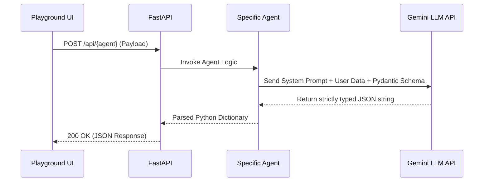

# API Flow

Because the agents are stateless functions, the API flow relies on passing strict JSON payloads and database IDs between endpoints.

## Standard Endpoint Interaction

## Example: Match Agent Flow

1. **Client** sends a `POST` request to `/api/match`. It provides `resume_id` and `jd_id`.
2. **API Router** fetches the raw Resume JSON and JD JSON from the database.
3. **Match Agent** compiles a prompt: *"Compare this Candidate {resume} with this Role {jd}."*
4. **Gemini LLM** responds with an evaluation matching the `MatchSchema`.
5. **Client** receives the JSON and visually renders the fit score and gaps.
