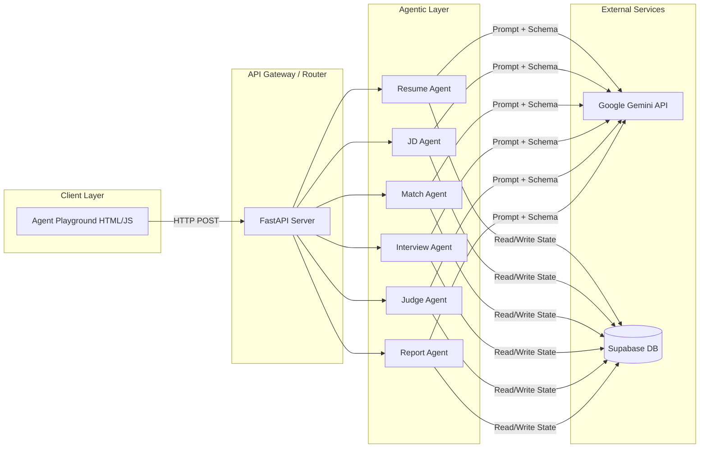

# System Architecture

The project is built on a modular, decoupled architecture, allowing each agent to act as an independent microservice or function. 

## High-Level Architecture

## Component Details

1. **Client Layer:** A lightweight HTML/JS frontend (Agent Playground) that makes direct API calls.
2. **Agentic Layer:** Pure Python modules. Each agent contains specialized system prompts and Pydantic schemas to strictly type the LLM outputs.
3. **LLM Engine:** `gemini_core.py` manages the connection to the Google Gemini API, ensuring consistent JSON enforcement across all agents.
4. **State Persistence:** Database integrations (like Supabase) are used to store parsed profiles and ongoing interview transcripts so that context is not lost between HTTP requests.
