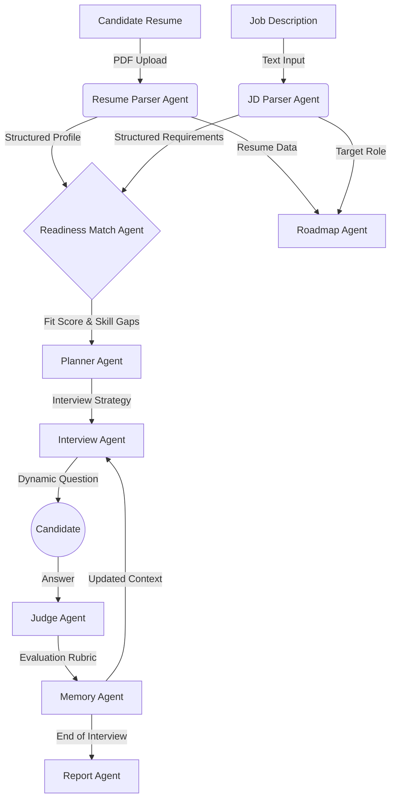

# Agent Workflow

The AB Talks AI Agentic System uses a linear, step-by-step workflow where the output of one agent becomes the context or direct input for the next. 

## Step-by-Step Flow

1. **Information Extraction**: The system begins by asynchronously parsing both the candidate's Resume and the target Job Description.
2. **Alignment Assessment**: The Readiness Match Agent takes both parsed schemas and computes an initial baseline fit.
3. **Strategic Planning**: The Planner Agent uses the identified gaps to map out an interview strategy.
4. **Adaptive Interviewing**: The Interview Agent asks questions, the candidate answers, and the Judge Agent evaluates. The Memory Agent continuously tracks what skills have been proven.
5. **Finalization**: The Report Agent aggregates the entire session, while the Roadmap Agent provides actionable career feedback.
